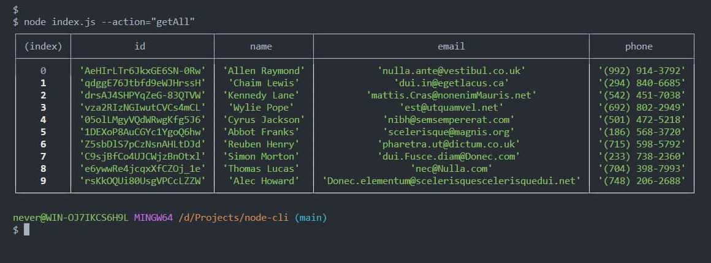
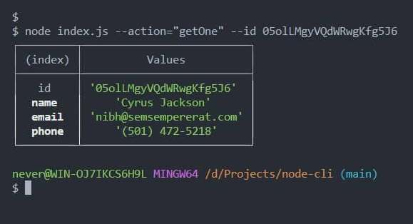
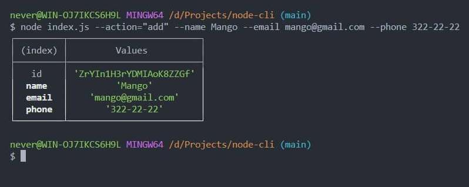

# У терміналі виводитиметься:

## Отримуємо і виводимо весь список контактів

`node index.js --action="getAll"`

## Отримуємо контакт по id і виводимо його у консоль

`node index.js --action="getOne" --id 05olLMgyVQdWRwgKfg5J6`

## Додаємо контакт та виводимо його в консоль

`node index.js --action="add" --name Mango --email mango@gmail.com --phone 322-22-22`

## Оновлюємо контакт та виводимо його в консоль

`node index.js --action="update" --id ZrYIn1H3rYDMIAoK8ZZGf --name "Alex NeverOff" --email neveroff@ukr.net --phone 322-22-22`

## Видаляємо контакт та виводимо його в консоль

`node index.js --action="remove" --id qdggE76Jtbfd9eWJHrssH`

